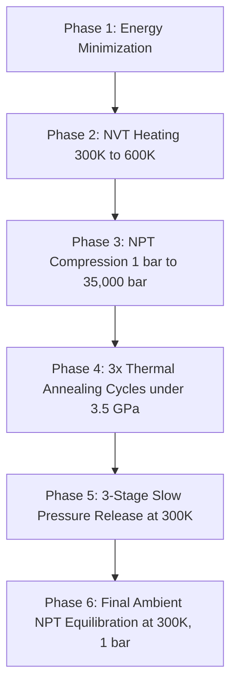

# PDMS Melt-Quench Densification Simulation

This directory contains scripts and configurations for running LAMMPS molecular dynamics simulations to densify crosslinked PDMS (polydimethylsiloxane) silicone rubber slabs using an advanced, state-of-the-art machine learning force field (MACE) and a multi-stage melt-quench protocol.

---

## 📌 Purpose & Chemical Context

* **Material**: Crosslinked PDMS (polydimethylsiloxane rubber)
* **Density Challenge**: Standard geometry-built PDMS structures start with a low, unrelaxed density of **~0.76 g/cm³**. Real-world cured silicone rubber has a physical density of **~1.10 g/cm³** (specific gravity ~1.10, tensile strength 7.5 MPa per JIS K6251).
* **Melt-Quench Goal**: Transform the unrelaxed, low-density starting structure into a realistic, compact silicone slab of **~0.98 - 1.10 g/cm³** by simulating thermal and high-pressure relaxation using PyTorch-backed Machine Learning Force Fields (MLFF).

---

## 🔄 Advanced Simulation Workflow

Instead of a simple heating/cooling cycle, this directory implements an **optimized 6-phase protocol** to overcome high-energy barriers in polymer packing without collapsing or blowing up the box:



1. **Phase 1: Energy Minimization**: Removes bad contacts and atomic overlaps from the initial geometry.
2. **Phase 2: NVT Heating (300K → 600K)**: Heats the box under fixed volume to prevent box explosion and early expansion.
3. **Phase 3: NPT Compression (1 bar → 35,000 bar / 3.5 GPa)**: Subjects the system to extreme pressure at 600 K to force chain compaction. (3.5 GPa represents the optimal sweet spot for PyTorch/MACE stability).
4. **Phase 4: Thermal Annealing under Pressure (3 Cycles)**: Thermally cycles the compressed box between 600 K and 300 K to lock polymer chain conformations and crosslinks.
5. **Phase 5: 3-Stage Slow Pressure Release (300K)**: Decompresses the box slowly (35 kbar → 10 kbar → 1 kbar → 1 bar) to minimize immediate elastic rebound.
6. **Phase 6: Final Ambient Equilibration (300K, 1 bar)**: Equilibrates the densified structure under standard atmospheric conditions.

---

## 📂 Directory Registry

### 🛠️ Input & Script Files
| File Name | Description |
| :--- | :--- |
| `silicone_slab.xyz` | Starting crosslinked PDMS geometry file (density ~0.76 g/cm³). |
| `xyz_to_lammps.py` | Python script to convert ASE-style XYZ coordinates to LAMMPS data format (`silicone_slab.lmpdat`). |
| `convert_mace_to_mliap.py` | PyTorch model exporter converting raw MACE models into MLIAP-compatible `.pt` files. |
| `lammps_melt_quench.inp` | The main LAMMPS simulation input script (timesteps, pressure targets, fixes). |
| `docker-compose.yml` | Container orchestration file to run GPU-accelerated LAMMPS and PyTorch conversions. |
| `run_simulation.bat` | Fully automated Windows batch script executing the entire end-to-end workflow. |

### 📈 Output & Trajectory Files
| File Name | Description |
| :--- | :--- |
| `densified_pdms.lmpdat` | **Primary Output**: Final densified structure in LAMMPS data format, ready for interface assembly. |
| `densified_pdms.xyz` | **Primary Output**: Final densified structure in standard XYZ coordinate format. |
| `densified_pdms.restart` | LAMMPS binary restart file to resume simulation if needed. |
| `full_trajectory.xyz` / `.lammpstrj` | Complete trajectory of the entire run (minimization + compression + annealing + release). |
| `trajectory.xyz` / `.lammpstrj` / `.dcd` | Standard trajectory files containing only the relaxation MD phases. |
| `log.lammps` | Standard LAMMPS thermodynamic output log detailing pressure, temperature, volume, and density. |
| `run_melt_quench_*.log` | Log file of the shell script/batch runner recording container setup, model downloads, and runtime events. |

---

## 🚀 Quick Start Guide

### 📋 Prerequisites
- **GPU Driver**: NVIDIA GPU with Docker Desktop + NVIDIA Container Toolkit installed.
- **MACE Models**: Automatically downloaded and converted by the automated workflow.

### ⚡ Automated Execution (Windows)
Simply run the batch script from a terminal or double-click it. It auto-detects prerequisites, downloads models, converts them to MLIAP, and triggers LAMMPS inside Docker:
```bash
run_simulation.bat
```

### 🛠️ Manual Execution (Command Line)
1. **Convert XYZ to LAMMPS format**:
   ```bash
   docker compose run --rm base python3 /workspace/xyz_to_lammps.py /workspace/silicone_slab.xyz /workspace/silicone_slab.lmpdat
   ```
2. **Download and Convert MACE Model** (e.g. Multi-Head MP model with `omol` head):
   ```bash
   docker compose run --rm mace_model_download mp mh-1
   docker compose run --rm mace_model_conversion python3 /workspace/convert_mace_to_mliap.py /workspace/mace_pretained_models/mace-mh-1.model /workspace/mace_pretained_models/mace-mh-1.model_omol.pt --head omol
   ```
3. **Run LAMMPS**:
   ```bash
   docker compose run --rm lammps_melt_quench lmp -k on g 1 -sf kk -pk kokkos neigh half newton on -var MODEL_PT_PATH mace_pretained_models/mace-mh-1.model_omol.pt -in lammps_melt_quench.inp
   ```

---

## 📊 Completed Simulation Benchmark (RTX 5090 Run)

Below are the actual benchmark statistics and density profiles obtained from the production run on an **NVIDIA GeForce RTX 5090** (using MACE Multi-Head PBE-refit model with `omol` head, `dt = 0.5 fs`):

### ⏱️ Performance Summary
* **Total Steps Executed**: 88,000 steps (equivalent to 44 ps total MD time).
* **Total Wall Time**: **43 hours 41 minutes 20 seconds** (heavy pair-potential overhead due to deep learning potential evaluations).
* **Average Speed**: ~0.56 timesteps/s (NPT production phase) down to ~0.17 timesteps/s (under high pressure).

### 📈 Density Evolution Profile
| Phase / State | Density (g/cm³) | Notes |
| :--- | :---: | :--- |
| **Initial starting box** | **0.762** | Loose polymer chains, unrelaxed |
| **After NVT heating (600 K)** | **0.762** | Volume locked |
| **After 3.5 GPa compression (600 K)** | **1.483** | Highly compressed packing |
| **Annealing Cycle 1** | **1.501** | Conformational rearrangement |
| **Annealing Cycle 2** | **1.501** | Stabilized conformation |
| **Annealing locked (300 K, 3.5 GPa)** | **1.500** | Packed structure ready for release |
| **Pressure release (10,000 bar)** | **1.280** | Intermediary decompression |
| **Pressure release (1,000 bar)** | **1.179** | Elastic expansion |
| **Pressure release (1 bar)** | **0.973** | Ambient state before equilibration |
| **Final Equilibrated (300 K, 1 bar)** | **0.983** | **Production output** (~10.6% deviation from bulk physical target) |

* **Final Box Dimensions**: $L_x = 20.21 \text{ Å}$, $L_y = 17.53 \text{ Å}$, $L_z = 18.37 \text{ Å}$

---

## 🛠️ Troubleshooting & Optimization

### 📉 Enhancing Final density
If the final relaxed density (~0.98 g/cm³) is lower than your physical bulk target (~1.10 g/cm³):
1. **Longer Ambient Equilibration**: Increase the final ambient step count `nstep_equil` from `20000` to `100000` (50 ps) to let elastic relaxation settle.
2. **Compressive Pre-bias**: Apply a small compressive pressure (e.g. NPT iso `5.0 5.0`) in Phase 6 instead of a pure `1.0 1.0` bar atmosphere.
3. **Slow down decompression**: Increase `nstep_release` steps in Phase 5 to let polymer chains accommodate volume expansion without excessive elastic recoil.

### 💥 Simulation Instability / PyTorch Crashes
- **Timestep Limit**: Machine learning force fields under high pressure are highly sensitive to atomic displacement. **Do not exceed `dt = 0.5 fs`** (`0.0005 ps`).
- **Thermostat damping**: Thermostat damping `tdamp` is set to `0.05 ps` (100x timestep) to efficiently sweep away the massive PV-work heat generated during compression. Do not increase it (e.g. to 0.1 or 0.5 ps), or the temperature will overshoot.
- **Neighbor list builds**: High pressure leads to frequent neighbor list updates. The script uses Kokkos-optimized binning (`neighbor 1.0 bin` + `neigh half`) to manage GPU workloads.
