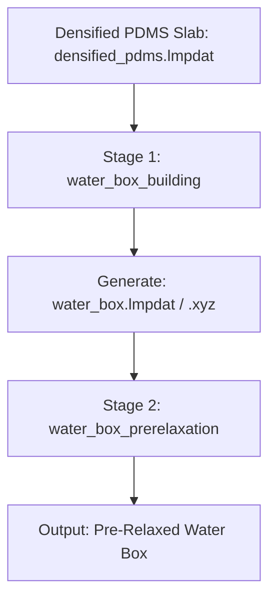

# PDMS-Matched Water Box Generation & Pre-Relaxation

This directory contains the tools and configurations required to generate and pre-relax a bulk water box that seamlessly matches the orthogonal $X$ and $Y$ box boundaries of the densified polydimethylsiloxane (PDMS) silicone slab. This ensures a flawless, gapless alignment for subsequent slab-water interface stacking.

---

## 📌 Workflow Overview

To build a stable interfacial model, the simulation box bounds must match perfectly in the lateral plane ($XY$). This package provides a two-stage pipeline:



1. **Stage 1 (`water_box_building`)**: Read the lateral dimensions ($L_x$, $L_y$) of the densified PDMS slab and generate an initial water box matching those coordinates with randomized packing using TIP4P/2005 molecular geometry.
2. **Stage 2 (`water_box_prerelaxation`)**: Relax the grid-placed water molecules under an NVT ensemble using a Machine Learning Force Field (MACE) to form a physical hydrogen-bonded liquid network prior to surface assembly.

---

## 🛠️ Component 1: Water Box Builder (`water_box_building`)

Located in [`water_box_building/`](file:///Users/siqi/GitHub/H2O2_interfacial_water/3.Prerelax_MatchingWater_Box/water_box_building), this module features a highly customizable Python generator `build_water_box.py`.

### 🌟 Key Features
* **Perfect XY Matching**: Automatically parses the orthogonal cell parameters (`xlo`/`xhi`, `ylo`/`yhi`) of a given LAMMPS data file (e.g. `densified_pdms.lmpdat`) so the lateral dimensions match down to $10^{-6}\text{ Å}$.
* **Flexible Z-Height Planning**:
  1. **By Molecule Count**: Specify the target number of water molecules ($N_{water}$); the script computes the required Z length ($L_z$) to achieve the target density.
  2. **By Box Height**: Specify the target Z height ($L_z$); the script computes the ideal number of molecules required to fill that volume at the target density.
* **TIP4P/2005 Geometry packing**: Placed oxygen centers are expanded into full tri-atomic water molecules with standard physical bonds ($d_{O-H} = 0.9572\text{ Å}$) and angle ($\theta_{H-O-H} = 104.52^\circ$).
* **Symmetry Breaking**: Water molecules are distributed onto a dynamic simple cubic grid with random 3D rotations and a **15% random positional perturbation** to avoid artificial crystalline symmetry, preventing thermodynamic bottlenecks during melting.

### ⚙️ Command-Line Arguments
| Argument | Type | Default | Description |
| :--- | :---: | :---: | :--- |
| `--pdms` | `str` | `densified_pdms.lmpdat` | Path to the template PDMS LAMMPS data file. |
| `--n_water` | `int` | `100` | Target number of water molecules (overrides `--lz` calculation). |
| `--lz` | `float` | `None` | Target Z box height in $\text{Å}$ (calculates `$N_{water}$` based on density). |
| `--density` | `float` | `1.0` | Target bulk water density in $\text{g/cm³}$. |
| `--output` | `str` | `water_box` | Basename for output `.xyz` and `.lmpdat` files. |
| `--margin` | `float` | `1.0` | Minimum clearance distance from the box boundary edges in $\text{Å}$. |
| `--seed` | `int` | `42` | Random seed for structural reproducibility. |

### 💻 Usage Examples
**A. Interactive Mode (prompts for inputs):**
```bash
python build_water_box.py
```

**B. Generate by fixed Z height (e.g., $20\text{ Å}$) at ambient density:**
```bash
python build_water_box.py --lz 20.0 --density 0.997 --output water_box
```

**C. Generate by molecule count (e.g., 500 water molecules):**
```bash
python build_water_box.py --n_water 500 --output water_box
```

---

## 🌀 Component 2: NVT Pre-Relaxation (`water_box_prerelaxation`)

Located in [`water_box_prerelaxation/`](file:///Users/siqi/GitHub/H2O2_interfacial_water/3.Prerelax_MatchingWater_Box/water_box_prerelaxation), this module focuses on eliminating steric strain and establishing a robust physical hydrogen-bond network.

### 🔬 Relaxation Protocol
Directly heating grid-placed water molecules can trigger local forces exceeding stable bounds. The input script `lammps_prerelaxtion.inp` utilizes a multi-step thermodynamic pathway:

1. **Energy Minimization (Phase 1)**: Employs conjugant gradient relaxation to resolve overlap energy spikes from grid placement.
2. **NVT Thermalization & Relaxation (Phase 2)**: Integrates the equations of motion under a strict canonical NVT ensemble at **$298\text{ K}$** for **50,000 steps (25 ps)**.
3. **Machine Learning Force Field (MACE)**: Leverages state-of-the-art high-accuracy Materials Project deep learning potentials (`mace-mh-1.model` with `omol` head) compiled into MLIAP PT format, ensuring highly precise hydrogen bonding, polarizability, and diffusion constants.
4. **Key Numerical Parameters**:
   * **Timestep (`dt`)**: Set to a conservative **$0.5\text{ fs}$** (`0.0005 ps`) to ensure numerical stability during PyTorch force evaluations.
   * **Thermostat Damping (`tdamp`)**: Set to **$0.05\text{ ps}$** (100 timesteps) to sweep away initialization heat spikes efficiently.

### 🚀 Automated Workflow (Windows Batch)
An automated runner `run_simulation.bat` is provided to handle the entire deep learning workflow inside high-performance containers:
```bash
run_simulation.bat
```
This automatically:
1. Verifies that the initial configuration `water_box.lmpdat` is built.
2. Downloads the selected MACE model (Default: `mp` type, `mh-1` size) if not found locally.
3. Converts the raw `.model` file to MLIAP `.pt` (e.g. `mace-mh-1.model_omol.pt` using the `omol` head).
4. Launches GPU-accelerated Kokkos-enabled LAMMPS inside Docker to complete the relaxation run.

---

## 📂 File Registry

| File Name | Path / Location | Description |
| :--- | :---: | :--- |
| `build_water_box.py` | `water_box_building/` | The Python script that parses PDMS geometry and structures the initial water coordinates. |
| `water_box.xyz` | `water_box_building/` | Generated intermediate extended XYZ coordinate file (ASE format). |
| `water_box.lmpdat` | `water_box_building/` | Generated orthogonal LAMMPS data file containing initial atomic coordinates. |
| `lammps_prerelaxtion.inp` | `water_box_prerelaxation/` | The input deck for the Kokkos-enabled NVT relaxation simulation. |
| `docker-compose.yml` | `water_box_prerelaxation/` | Container orchestration configurations for GPU, base PyTorch, and LAMMPS environments. |
| `water_box_relaxed.lmpdat` | `water_box_prerelaxation/` | **Final Product**: Highly relaxed, equilibrated water slab in LAMMPS format, ready for interface assembly. |
| `water_box_relaxed.xyz` | `water_box_prerelaxation/` | **Final Product**: Equilibrated Z-matched water slab coordinate file in standard XYZ format. |
| `trajectory_water.xyz` / `.lammpstrj` | `water_box_prerelaxation/` | Output trajectory logging structural relaxation during NVT equilibration. |
| `log.lammps` | `water_box_prerelaxation/` | Simulation log containing step-by-step thermodynamics (temperature, pressure, potential energy). |
